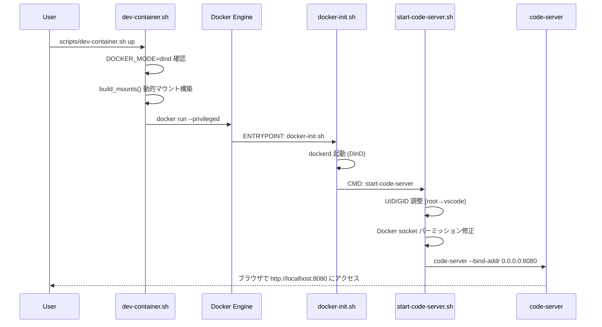
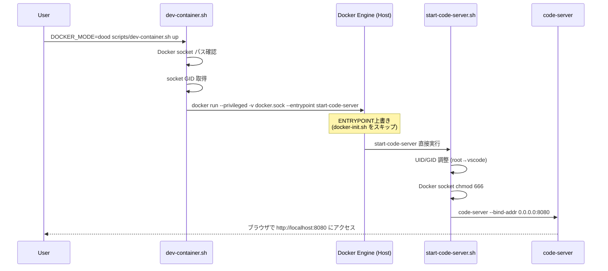
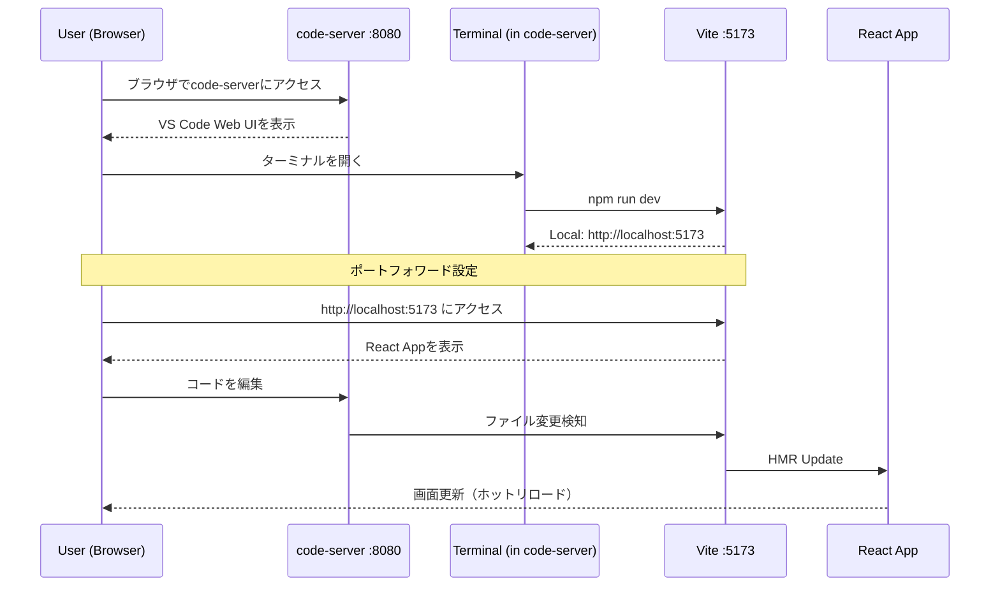
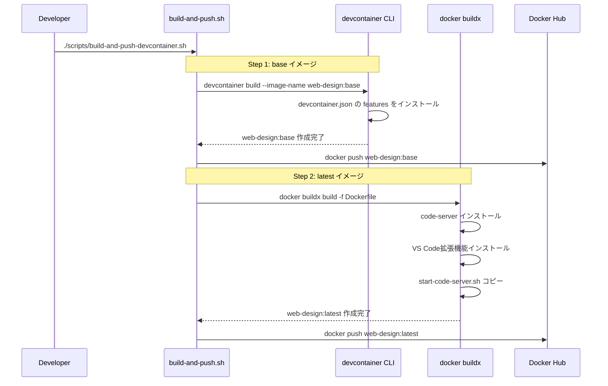
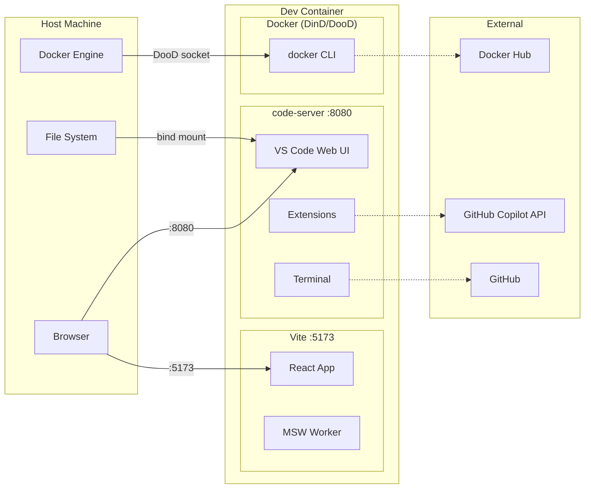

# 統合ポイント調査

## 概要

web-designの開発環境における統合ポイントを分析する。主な統合ポイントは、code-serverとVite dev server間のポートフォワード、Docker Engine との DooD/DinD 連携、および code-server の VS Code 拡張機能連携である。

## ポート構成

| サービス | ポート | 用途 | アクセス方法 |
|----------|--------|------|-------------|
| code-server | 8080 | ブラウザベースVS Code | `http://localhost:8080` |
| Vite dev server | 5173 | React ホットリロード | code-server内ポートフォワード or `http://localhost:5173` |
| Vite HMR WebSocket | 5173 | Hot Module Replacement | 自動接続 |

## シーケンス図

### コンテナ起動フロー（DinDモード）

### コンテナ起動フロー（DooDモード）

### React開発ワークフロー

### プリビルドイメージ作成フロー

## 統合ポイント一覧

### code-server ↔ Vite Dev Server

| 項目 | 詳細 |
|------|------|
| 連携方式 | ポートフォワード |
| code-server側 | `forwardPorts` 設定、またはターミナルからアクセス |
| Vite側 | `--host 0.0.0.0` オプションでコンテナ外からアクセス可能に |
| HMR | WebSocket接続で自動更新 |

### code-server ↔ VS Code拡張機能

| 項目 | 詳細 |
|------|------|
| インストール方法 | Dockerfile内で `code-server --install-extension <id>` |
| 設定ファイル | `~/.local/share/code-server/User/settings.json` |
| 拡張機能ディレクトリ | `~/.local/share/code-server/extensions/` |

### Docker Engine ↔ dev-container.sh

| 項目 | DinD | DooD |
|------|------|------|
| Docker daemon | コンテナ内dockerd | ホストのdockerd |
| Socket | 自動生成 | ホストからマウント |
| ENTRYPOINT | `docker-init.sh` → `start-code-server` | `start-code-server` (直接) |
| 特権 | `--privileged` | `--privileged` |
| ソケットパーミッション | 自動 | `chmod 666` or `--group-add` |

### dev-container.sh ↔ ホストファイルシステム

| マウント | ソース | ターゲット | モード | 用途 |
|----------|--------|------------|--------|------|
| ワークスペース | `${WORKSPACE_DIR}` | `/workspaces/${PROJECT_NAME}` | rw | ソースコード |
| Git設定 | `~/.gitconfig` | `/home/vscode/.gitconfig` | ro | Git認証 |
| SSH鍵 | `~/.ssh` | `/home/vscode/.ssh` | ro | Git SSH |
| Claude設定 | `~/.claude` | `/home/vscode/.claude` | cached | Claude Code |
| Claude JSON | `~/.claude.json` | `/home/vscode/.claude.json` | cached | Claude Code |
| Copilot設定 | `~/.copilot` | `/home/vscode/.copilot` | cached | Copilot認証 |
| Docker socket | `/var/run/docker.sock` | `/var/run/docker.sock` | rw | DooD時のみ |

## 外部サービス連携

| サービス | 連携方式 | 用途 | 設定方法 |
|----------|----------|------|----------|
| Docker Hub | HTTP API | プリビルドイメージpush/pull | `docker login` |
| GitHub | SSH/HTTPS | ソースコード管理 | `~/.ssh`, `~/.gitconfig` マウント |
| GitHub Copilot | VS Code拡張機能 | AIコード補完 | `~/.copilot` マウント |
| MSW (ローカル) | Service Worker | APIモック | ブラウザ内で完結 |

## 連携図

## 備考

- code-serverのポートフォワード機能により、Vite dev serverのポート(5173)をcode-server経由でアクセスすることも可能
- DooD/DinDの切り替えはコンテナ起動時に決定され、実行中の切り替えは不可
- MSWはService Workerとしてブラウザ内で動作するため、外部サービスとの通信は発生しない
- `docker run` 時に `-p 8080:8080 -p 5173:5173` のポートマッピングが必要（dev-container.shに追加）
