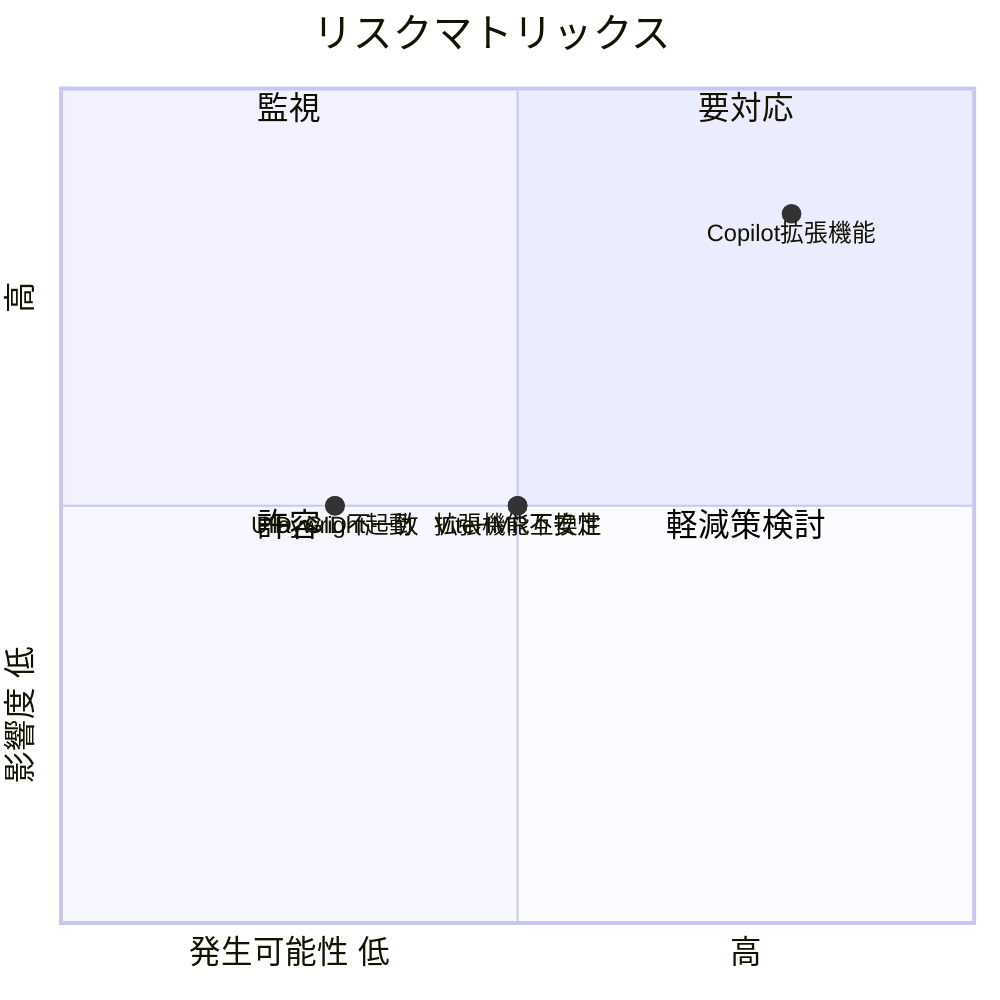
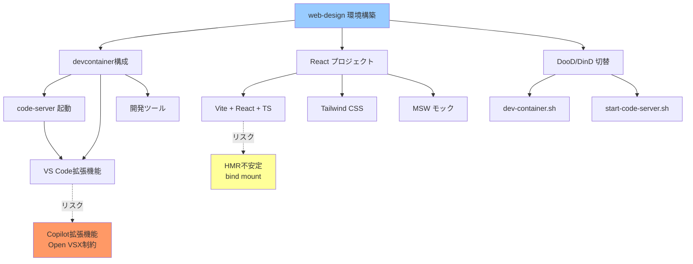

# リスク・制約分析

## 概要

web-design環境構築における技術的リスクと制約を分析する。特にcode-serverでのGitHub Copilot動作、DooD/DinD切り替えの互換性、およびViteホットリロードのコンテナ環境での動作が主要なリスクである。

## 技術的リスク

| リスク | 影響度 | 発生可能性 | 対策 |
|--------|--------|------------|------|
| code-serverでGitHub Copilot拡張機能が動作しない | 高 | 高 | Open VSXレジストリ制約のため、VSIX手動インストールまたは代替手段を検討 |
| Vite HMRがコンテナ環境で不安定 | 中 | 中 | `server.watch.usePolling: true` 設定で対応 |
| code-server の拡張機能互換性 | 中 | 中 | 事前に各拡張機能のcode-server対応を確認 |
| DooD時のUID/GID不一致 | 中 | 低 | start-code-server.shでUID/GID調整ロジックを移植 |
| Playwright がheadlessブラウザを起動できない | 中 | 低 | devcontainer featureで依存ライブラリが自動インストールされることを確認 |

### リスクマトリックス



## GitHub Copilot in code-server — 詳細リスク分析

### 問題の背景

code-serverはOpen Source版VS Codeをベースとしており、Microsoft Marketplace（VS Code Marketplace）の拡張機能を直接利用できない。代わりにOpen VSX Registryを使用する。

### GitHub Copilot の制約

| 項目 | VS Code (Desktop) | code-server |
|------|-------------------|-------------|
| Marketplace | Microsoft Marketplace | Open VSX Registry |
| Copilot拡張機能 | ✅ 利用可能 | ⚠️ Open VSXに公開されていない |
| Copilot Chat | ✅ 利用可能 | ⚠️ Open VSXに公開されていない |
| インストール方法 | マーケットプレースから | VSIX手動インストール |

### 対応策

1. **VSIX手動インストール**: GitHub Copilot の `.vsix` ファイルをダウンロードし、`code-server --install-extension copilot.vsix` でインストール
2. **marketplace.json の上書き**: code-serverの設定で Microsoft Marketplace を参照するよう変更（ライセンス上の注意が必要）
3. **代替手段**: code-server上ではCopilotを使わず、ターミナルからCopilot CLIを使用

### 推奨アプローチ

Dockerfile内でVSIXファイルをダウンロードしてインストールする方法を検討：

```dockerfile
# GitHub Copilot VSIX のインストール例
RUN code-server --install-extension GitHub.copilot || true
RUN code-server --install-extension GitHub.copilot-chat || true
```

ただし、Open VSXに存在しない場合はVSIXファイルの直接取得が必要。

## code-server 固有の制約

| 制約 | 詳細 | 影響範囲 | 対応方針 |
|------|------|----------|----------|
| Open VSX Registry | Microsoft Marketplace非対応 | 拡張機能の選択肢 | VSIX手動インストール or marketplace.json上書き |
| 認証方式 | パスワード or なし（`--auth none`） | セキュリティ | ローカル開発用のため `--auth none` 推奨 |
| ポート固定 | デフォルト 8080 | ポート競合の可能性 | 環境変数で変更可能に |
| WebSocket対応 | HMRに必要 | Viteホットリロード | プロキシなしの直接接続推奨 |

## Vite + コンテナ環境の制約

| 制約 | 詳細 | 対応方針 |
|------|------|----------|
| ファイル監視 | コンテナ内のbind mountではinotifyが効かない場合あり | `server.watch.usePolling: true` |
| ホストアクセス | デフォルトで `localhost` のみ | `server.host: '0.0.0.0'` |
| HMR接続 | WebSocketがプロキシで遮断される場合あり | 直接ポートマッピング推奨 |
| ビルドパフォーマンス | bind mountはI/O性能が低い | `node_modules` をnamed volumeに |

## DooD/DinD の制約

| 項目 | DinD | DooD |
|------|------|------|
| 特権 | `--privileged` 必須 | `--privileged` 必須 |
| パフォーマンス | やや遅い（ネストされたDocker） | ホスト同等 |
| イメージキャッシュ | コンテナ破棄で消失 | ホストと共有 |
| セキュリティ | 分離されている | ホストDockerを共有 |
| ソケットパーミッション | 自動 | 手動調整必要 |
| ポートマッピング | ホスト↔コンテナ | ホスト↔コンテナ（ホストDockerのネットワーク） |

## 設計上の制約

| 制約 | 理由 | 対応方針 |
|------|------|----------|
| Platform linux/amd64 のみ | dev-processとの整合性、CI環境 | ARM対応は将来検討 |
| バックエンドなし | 要件定義フェーズのため | MSWでAPIモック |
| E2Eテストのみ | brainstormingで決定 | 単体テストは将来追加 |
| Node.js LTS | ベースイメージ制約 | メジャーバージョン固定 |

## セキュリティ考慮事項

| 項目 | 現状 | リスク | 対策 |
|------|------|--------|------|
| code-server認証 | `--auth none` | ローカルネットワーク内からアクセス可能 | ローカル開発用のため許容、本番不可 |
| `--privileged` | DinD/DooD両方で使用 | コンテナエスケープの可能性 | ローカル開発環境のため許容 |
| Docker socket マウント | DooD時 | ホストDockerへの完全アクセス | 開発用のため許容 |
| VSIX手動インストール | Copilot拡張機能 | 改ざんされたVSIXのリスク | 公式ソースからのダウンロードを徹底 |

## パフォーマンス考慮事項

| 項目 | 懸念 | 対策 |
|------|------|------|
| node_modules I/O | bind mountでnpm installが遅い | `node_modules` をnamed volumeに |
| Vite HMR | bind mount上のファイル監視遅延 | `usePolling` 設定 |
| code-server起動 | 拡張機能数に比例して遅くなる | 必要最小限の拡張機能に絞る |
| Playwright | ブラウザ起動に時間がかかる | devcontainer featureで依存を事前インストール |

## 影響度・依存関係



## 緩和策一覧

| リスク/制約 | 緩和策 | 優先度 |
|-------------|--------|--------|
| Copilot拡張機能 Open VSX制約 | VSIX手動インストール、marketplace.json上書き、またはCopilot CLI代替 | 高 |
| Vite HMR不安定 | `usePolling` + `interval` 設定 | 高 |
| node_modules I/O遅延 | named volume使用 | 中 |
| code-server認証なし | ローカル限定使用を文書化 | 低 |
| Platform制約 (amd64) | 将来のマルチアーキテクチャ対応検討 | 低 |

## ロールバック計画

| フェーズ | ロールバック方法 | 所要時間 |
|----------|------------------|----------|
| devcontainer構成変更 | gitでファイル切り戻し | 5分 |
| プリビルドイメージ | Docker Hubから以前のタグをpull | 10分 |
| Reactプロジェクト初期化 | `npm create vite@latest` で再作成 | 5分 |
| code-server不具合 | tmux構成にフォールバック（dev-processパターン） | 30分 |

## 備考

- GitHub Copilot の code-server 対応は最大のリスク要因。設計段階でフォールバック方針（Copilot CLI利用）を確定しておく必要がある
- MSW (Mock Service Worker) はService Worker登録にHTTPSが推奨されるが、localhost では HTTP でも動作する
- Playwright E2Eテストはdevcontainerのビルド・起動を前提とするため、テスト実行環境自体にDockerが必要
- dev-container.shにポートマッピング（`-p 8080:8080 -p 5173:5173`）を追加する必要がある
