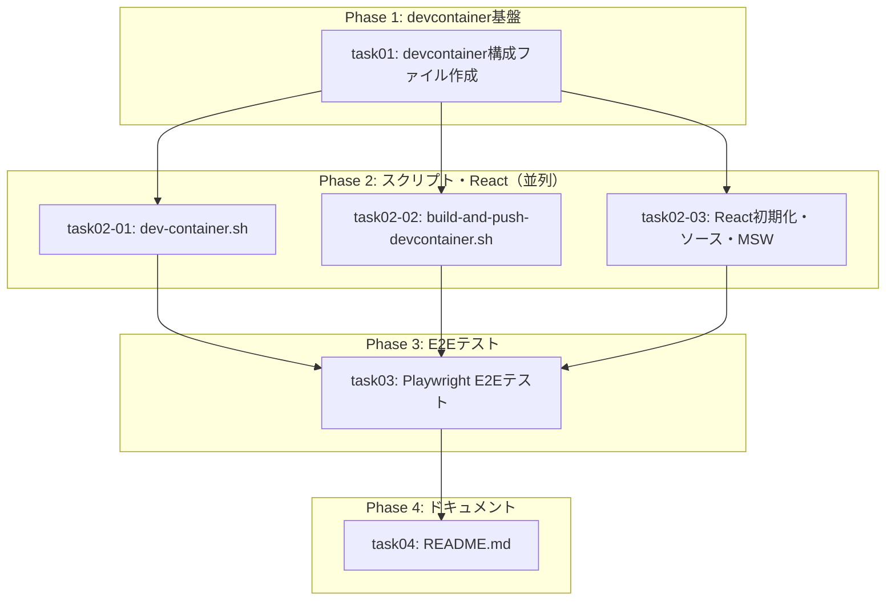

# 統合管理プロンプト: WEB-DESIGN-001 - ウェブデザイン要件定義プロジェクト環境構築

## 概要

このプロンプトは、タスク計画に基づいて子エージェントを管理し、並列実行を調整するための統合管理ガイドです。

| 項目 | 値 |
|------|-----|
| チケットID | WEB-DESIGN-001 |
| タスク名 | ウェブデザイン要件定義プロジェクト環境構築 |
| 総タスク数 | 6 |
| 並列グループ数 | 3（Phase 2で3並列） |
| 推定総時間 | 約80分（クリティカルパス: 約55分） |
| 対象リポジトリ | submodules/web-design |

---

## 全タスク一覧

| タスク識別子 | タスク名 | 前提条件 | 並列可否 | 推定時間 | ステータス |
|--------------|----------|----------|----------|----------|------------|
| task01 | devcontainer構成ファイル作成 | なし | 不可 | 15min | ⬜ 未着手 |
| task02-01 | dev-container.sh作成 | task01 | 可 | 15min | ⬜ 未着手 |
| task02-02 | build-and-push-devcontainer.sh作成 | task01 | 可 | 10min | ⬜ 未着手 |
| task02-03 | React初期化・ソース・MSW | task01 | 可 | 15min | ⬜ 未着手 |
| task03 | Playwright E2Eテスト作成 | task02-01, task02-02, task02-03 | 不可 | 15min | ⬜ 未着手 |
| task04 | README.md作成 | task03 | 不可 | 10min | ⬜ 未着手 |

---

## 依存関係グラフ



---

## 並列実行グループ

### Group 1: devcontainer基盤（単独実行）

| タスク | 推定時間 | プロンプト |
|--------|----------|------------|
| task01 | 15min | [task01.md](task01.md) |

**開始条件**: なし（初期グループ）
**完了条件**: task01が完了

---

### Group 2: スクリプト・React（3並列実行）

| タスク | 推定時間 | プロンプト |
|--------|----------|------------|
| task02-01 | 15min | [task02-01.md](task02-01.md) |
| task02-02 | 10min | [task02-02.md](task02-02.md) |
| task02-03 | 15min | [task02-03.md](task02-03.md) |

**開始条件**: Group 1完了（task01完了）
**完了条件**: task02-01, task02-02, task02-03 すべて完了

**並列実行の根拠**:
- 相互依存なし
- 異なるディレクトリのファイルを編集:
  - task02-01: `scripts/dev-container.sh`
  - task02-02: `scripts/build-and-push-devcontainer.sh`
  - task02-03: `package.json`, `src/`, `index.html`, `vite.config.ts`, `tsconfig*.json`, `eslint.config.js`, `.prettierrc`, `.gitignore`
- 共有状態変更なし

---

### Group 3: E2Eテスト（単独実行）

| タスク | 推定時間 | プロンプト |
|--------|----------|------------|
| task03 | 15min | [task03.md](task03.md) |

**開始条件**: Group 2完了（task02-01, task02-02, task02-03 全完了）
**完了条件**: task03完了

---

### Group 4: ドキュメント（単独実行）

| タスク | 推定時間 | プロンプト |
|--------|----------|------------|
| task04 | 10min | [task04.md](task04.md) |

**開始条件**: Group 3完了（task03完了）
**完了条件**: task04完了

---

## 実行順序

1. **Phase 1**: task01を実行
2. **Checkpoint 1**: task01の完了確認（devcontainer.json, Dockerfile, start-code-server.sh の存在確認）
3. **Phase 2**: task02-01, task02-02, task02-03を並列実行
4. **Checkpoint 2**: 並列タスクの全完了確認、cherry-pick完了確認
5. **Phase 3**: task03を実行
6. **Checkpoint 3**: E2Eテストファイルの存在確認（10ケース）
7. **Phase 4**: task04を実行
8. **Final**: 全タスク完了確認

---

## タスクプロンプト参照

| タスク | プロンプトファイル |
|--------|-------------------|
| task01 | [task01.md](task01.md) |
| task02-01 | [task02-01.md](task02-01.md) |
| task02-02 | [task02-02.md](task02-02.md) |
| task02-03 | [task02-03.md](task02-03.md) |
| task03 | [task03.md](task03.md) |
| task04 | [task04.md](task04.md) |

---

## Worktree管理手順

### 実行開始時: メインworktreeの作成

```bash
REPO_ROOT=$(git rev-parse --show-toplevel)
REQUEST_NAME="WEB-DESIGN-001"

# メインworktreeの作成（submodules/web-design内で実行）
cd $REPO_ROOT/submodules/web-design
git branch $REQUEST_NAME HEAD 2>/dev/null || echo "ブランチは既に存在"
git worktree add /tmp/$REQUEST_NAME $REQUEST_NAME
echo "メインworktree作成: /tmp/$REQUEST_NAME"
```

### 各タスク実行前: サブworktreeの作成

```bash
REQUEST_NAME="WEB-DESIGN-001"
TASK_ID="{task-id}"  # task01, task02-01, etc.
REPO_ROOT=$(git rev-parse --show-toplevel)

# サブブランチ作成
cd /tmp/$REQUEST_NAME
git branch ${REQUEST_NAME}-${TASK_ID} HEAD

# サブworktreeの作成
cd $REPO_ROOT/submodules/web-design
git worktree add /tmp/${REQUEST_NAME}-${TASK_ID} ${REQUEST_NAME}-${TASK_ID}
```

### Phase 2並列タスク用: 一括作成

```bash
REQUEST_NAME="WEB-DESIGN-001"
REPO_ROOT=$(git rev-parse --show-toplevel)

# ベースコミットを固定
cd /tmp/$REQUEST_NAME
BASE_COMMIT=$(git rev-parse HEAD)

# 並列タスクごとにworktree作成
cd $REPO_ROOT/submodules/web-design
for TASK_ID in task02-01 task02-02 task02-03; do
    git branch ${REQUEST_NAME}-${TASK_ID} $BASE_COMMIT
    git worktree add /tmp/${REQUEST_NAME}-${TASK_ID} ${REQUEST_NAME}-${TASK_ID}
done
```

---

## Cherry-pickフロー

### Phase 1完了後（task01）

```bash
REQUEST_NAME="WEB-DESIGN-001"
REPO_ROOT=$(git rev-parse --show-toplevel)

# task01のcherry-pick
cd /tmp/${REQUEST_NAME}-task01
COMMIT_HASH=$(git rev-parse HEAD)

cd /tmp/$REQUEST_NAME
git cherry-pick $COMMIT_HASH

# サブworktree削除
cd $REPO_ROOT/submodules/web-design
git worktree remove /tmp/${REQUEST_NAME}-task01 --force
git branch -D ${REQUEST_NAME}-task01
```

### Phase 2完了後（並列タスク一括）

```bash
REQUEST_NAME="WEB-DESIGN-001"
REPO_ROOT=$(git rev-parse --show-toplevel)

# 順番にcherry-pick（ファイル競合なし）
cd /tmp/$REQUEST_NAME
for TASK_ID in task02-01 task02-02 task02-03; do
    cd /tmp/${REQUEST_NAME}-${TASK_ID}
    COMMIT_HASH=$(git rev-parse HEAD)

    cd /tmp/$REQUEST_NAME
    git cherry-pick $COMMIT_HASH
done

# サブworktree一括削除
cd $REPO_ROOT/submodules/web-design
for TASK_ID in task02-01 task02-02 task02-03; do
    git worktree remove /tmp/${REQUEST_NAME}-${TASK_ID} --force
    git branch -D ${REQUEST_NAME}-${TASK_ID}
done
```

### Phase 3, 4完了後（task03, task04）

同様にcherry-pickとworktree削除を実行。

---

## ブロッカー管理

### ブロッカー発生時の対応

| 状況 | 対応 |
|------|------|
| タスク失敗 | 原因を分析、サブworktree削除、再依頼または代替案 |
| 依存タスク未完了 | 待機、完了後に再開 |
| cherry-pickコンフリクト | Phase 2は異なるファイルを編集するためコンフリクト発生しないはず。発生時は手動解消 |
| devcontainerビルド失敗 | Dockerfile/devcontainer.jsonの修正が必要。task01を修正してre-run |

---

## 結果統合方法

### 各タスク完了時の確認

1. 対象ファイルの存在確認
2. bash構文チェック（スクリプトの場合）
3. JSON構文チェック（設定ファイルの場合）
4. コミットハッシュの記録

### Phase 2完了後の統合確認

1. 全タスクのcherry-pick完了
2. コンフリクトがないことを確認
3. ファイル構造が設計書（03_data-structure-design.md）と一致することを確認

### 最終統合

1. 全タスク完了の確認
2. `submodules/web-design` のファイル構造を設計書と照合
3. 完了レポート作成

---

## 実行履歴

### タスク実行記録

| タスク | 開始時刻 | 完了時刻 | コミット | ステータス |
|--------|----------|----------|----------|------------|
| task01 | - | - | - | ⬜ 未着手 |
| task02-01 | - | - | - | ⬜ 未着手 |
| task02-02 | - | - | - | ⬜ 未着手 |
| task02-03 | - | - | - | ⬜ 未着手 |
| task03 | - | - | - | ⬜ 未着手 |
| task04 | - | - | - | ⬜ 未着手 |

### 進捗サマリー

- 完了: 0/6
- 進行中: 0
- 待機: 6

---

## チェックポイント

| ID | タイミング | チェック内容 | 結果 |
|----|------------|--------------|------|
| CP1 | Phase 1完了後 | task01完了、.devcontainer/配下の3ファイル存在確認 | ⬜ |
| CP2 | Phase 2完了後 | task02-01/02/03全完了、cherry-pick完了、ファイル構造確認 | ⬜ |
| CP3 | Phase 3完了後 | task03完了、e2e/配下の8ファイル存在確認 | ⬜ |
| CP4 | Phase 4完了後 | task04完了、README.md存在確認 | ⬜ |

---

## 完了条件

### 全体完了条件

- [ ] 全6タスクが完了していること
- [ ] 全cherry-pickが完了していること
- [ ] submodules/web-designのファイル構造が設計書と一致すること
- [ ] acceptance_criteriaの全項目に対応するファイルが存在すること

### acceptance_criteria検証（verificationフェーズで実施）

| criteria | 検証方法 | タスク |
|----------|----------|--------|
| devcontainerでcode-serverが起動しブラウザからアクセスできる | E2E-1 | task03 |
| Reactプロジェクトが初期化されcode-server上でプレビューできる | E2E-2 | task03 |
| DooD/DinD切り替え機構が動作する | E2E-5, E2E-6 | task03 |
| copilot CLI, git, playwright, prettierが使用可能 | E2E-4 | task03 |
| code-serverにReact開発用拡張機能がインストールされている | E2E-3 | task03 |
| Copilot CLIが使用可能 | E2E-7 | task03 |
| 画面デザインのモック作成・プレビューのワークフローが確立されている | E2E-2, E2E-10 | task03 |

---

## 注意事項

- 各タスクプロンプト（task0X.md）の内容を正確に子エージェントに伝える
- 並列タスク（Phase 2）は同じベースコミットから分岐させる
- cherry-pickの順序を守る（Phase 2は task02-01 → task02-02 → task02-03 の順）
- 全タスク完了後もメインworktreeは残す（ユーザー確認用）
- テスト戦略はE2Eのみ。個別タスクでの単体テスト・結合テストは不要
- コミットメッセージには `Co-authored-by: Copilot <223556219+Copilot@users.noreply.github.com>` を含める
