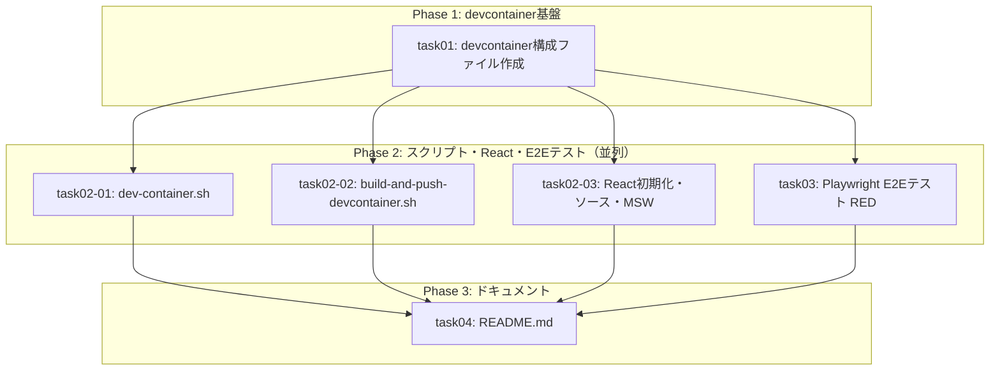

# タスク一覧: WEB-DESIGN-001

## 概要

| 項目 | 値 |
|------|-----|
| チケットID | WEB-DESIGN-001 |
| タスク名 | ウェブデザイン要件定義プロジェクト環境構築 |
| 総タスク数 | 6 |
| 並列グループ数 | 2（Phase 2で4並列） |
| 推定総時間 | 約90分（クリティカルパス: 約50分） |

---

## タスク一覧

| タスク識別子 | タスク名 | 前提条件 | 並列可否 | 推定時間 | ステータス |
|--------------|----------|----------|----------|----------|------------|
| task01 | devcontainer構成ファイル作成 | なし | 不可 | 15min | ⬜ 未着手 |
| task02-01 | dev-container.sh作成 | task01 | 可（task02-02, task02-03と並列） | 15min | ⬜ 未着手 |
| task02-02 | build-and-push-devcontainer.sh作成 | task01 | 可（task02-01, task02-03と並列） | 10min | ⬜ 未着手 |
| task02-03 | Reactプロジェクト初期化・ソースコード・MSW設定 | task01 | 可（task02-01, task02-02と並列） | 25min | ⬜ 未着手 |
| task03 | Playwright E2Eテスト作成 | task01 | 可（task02-01, task02-02, task02-03と並列） | 25min | ⬜ 未着手 |
| task04 | README.md作成 | task02-01, task02-02, task02-03, task03 | 不可 | 10min | ⬜ 未着手 |

---

## TDD方針（RED→GREENフロー）

本プロジェクトではE2Eテストのみをテスト戦略としている。TDDの原則に従い、以下の順序で実装を進める:

1. **RED**: task03（E2Eテスト作成）でテストコードを先に作成する。この時点ではdevcontainer未ビルドのためテストは実行不可（RED状態）
2. **GREEN**: task01→task02-01/02/03の実装により、テスト対象の成果物が揃う
3. **VERIFY**: verificationフェーズでdevcontainerをビルド・起動し、E2Eテストを実行して全テストがパスすることを確認（GREEN状態）

> **MRP-003対応**: task03はPhase 2の並列タスクと同時に実行可能。task03は他タスクのファイルを参照するが、ファイル生成には依存しない（テストコードの記述のみ）。テスト実行はverificationフェーズで行う。

---

## 依存関係グラフ

---

## フェーズ別実行計画

### Phase 1: devcontainer基盤（単独実行）
- **task01**: devcontainer構成ファイル作成
- 所要時間: 15min

### Phase 2: スクリプト・React・E2Eテスト（4並列実行）
- **task02-01**: dev-container.sh作成（DooD/DinD切替）
- **task02-02**: build-and-push-devcontainer.sh作成
- **task02-03**: Reactプロジェクト初期化・ソースコード・MSW設定
- **task03**: Playwright E2Eテスト作成（10ケース）— RED状態（テストコード記述のみ、実行はverificationフェーズ）
- 所要時間: 25min（並列実行のため最長タスクの時間）

### Phase 3: ドキュメント（単独実行）
- **task04**: README.md作成
- 所要時間: 10min

---

## クリティカルパス

task01 → task02-01/02-02/02-03/task03 → task04

**推定クリティカルパス時間**: 15 + 25 + 10 = **50分**

> **注記 (MRP-008)**: task03をPhase 2に移動し並列化。バッファ追加済（task02-03: 15→25分、task03: 15→25分）。Phase 2の最長タスクは25分。

---

## acceptance_criteria とタスクの対応

| acceptance_criteria | 対応タスク |
|---------------------|-----------|
| devcontainerでcode-serverが起動し、ブラウザからアクセスできる | task01, task02-01 |
| Reactプロジェクトが初期化され、code-server上でプレビューできる | task02-03 |
| DooD/DinD切り替え機構が動作する | task02-01 |
| copilot CLI, git, playwright, prettierが使用可能 | task01 |
| code-serverにReact開発用拡張機能がインストールされている | task01 |
| GitHub Copilot CLI が使用可能である（Open VSX制約によりCopilot拡張はCLIで代替） | task01（CLIで代替） |
| 画面デザインのモック作成・プレビューのワークフローが確立されている | task02-03 |
| E2Eテストが全項目パスすること | task03 |

> **要件変更記録 (MRP-001)**: setup.yaml の acceptance_criteria「code-serverにGitHub Copilot拡張機能がインストールされている」は「GitHub Copilot CLI が使用可能である（Open VSX制約によりCopilot拡張はCLIで代替）」に正式変更。Open VSXにCopilot拡張が公開されていないため、devcontainer feature `copilot-cli:1` によるCLI代替を採用する。

---

## verificationフェーズ検証チェックリスト（MRP-002対応）

設計書06（弊害検証計画）の検証項目をverificationフェーズで実施する。E2Eテストでカバーできない項目は手動検証として整理する。

### 自動検証（E2Eテスト）

| 検証項目 | E2Eテストケース | 備考 |
|----------|----------------|------|
| code-serverアクセス | E2E-1 | — |
| Reactプレビュー | E2E-2 | — |
| 拡張機能インストール | E2E-3 | — |
| 開発ツール動作 | E2E-4 | — |
| DinDモード | E2E-5 | — |
| DooDモード | E2E-6 | — |
| Copilot CLI | E2E-7 | — |
| HMR反映 | E2E-8 | — |
| MSWモック応答 | E2E-9 | — |
| MSW Service Worker登録 | E2E-10 | — |

### 手動検証チェックリスト

| No | 検証項目 | 確認内容 | 判定基準 | チェック |
|----|----------|----------|----------|----------|
| V-01 | HMR性能 | Vite HMR反映時間の測定 | 3秒以内（usePolling環境） | ⬜ |
| V-02 | code-server認証設定 | `--auth none` が意図的であること確認、READMEに注意事項記載確認 | READMEにセキュリティ注意事項あり | ⬜ |
| V-03 | `--privileged`フラグ | DinD/DooD両方でprivilegedが設定されていること | dev-container.shのフラグ確認 | ⬜ |
| V-04 | Docker socket (DooD) | DooD時のchmod 666影響確認 | start-code-server.sh確認 | ⬜ |
| V-05 | UID/GID調整 | DooD時のファイルパーミッション確認 | コンテナ内ファイルのowner確認 | ⬜ |
| V-06 | devcontainerビルド時間 | ビルド時間の測定 | 10分以内 | ⬜ |
| V-07 | npm install時間 | bind mount環境でのnpm install時間 | 60秒以内 | ⬜ |
| V-08 | ポート競合確認 | 8080/5173使用中に起動を試行 | エラーメッセージ表示 | ⬜ |
