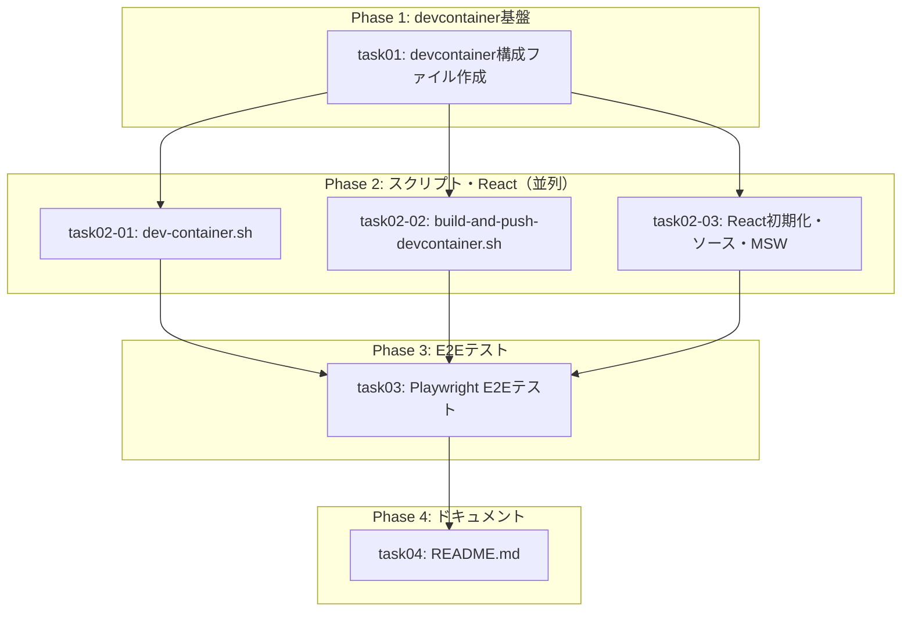

# タスク一覧: WEB-DESIGN-001

## 概要

| 項目 | 値 |
|------|-----|
| チケットID | WEB-DESIGN-001 |
| タスク名 | ウェブデザイン要件定義プロジェクト環境構築 |
| 総タスク数 | 6 |
| 並列グループ数 | 3（Phase 2で3並列） |
| 推定総時間 | 約80分（クリティカルパス: 約50分） |

---

## タスク一覧

| タスク識別子 | タスク名 | 前提条件 | 並列可否 | 推定時間 | ステータス |
|--------------|----------|----------|----------|----------|------------|
| task01 | devcontainer構成ファイル作成 | なし | 不可 | 15min | ⬜ 未着手 |
| task02-01 | dev-container.sh作成 | task01 | 可（task02-02, task02-03と並列） | 15min | ⬜ 未着手 |
| task02-02 | build-and-push-devcontainer.sh作成 | task01 | 可（task02-01, task02-03と並列） | 10min | ⬜ 未着手 |
| task02-03 | Reactプロジェクト初期化・ソースコード・MSW設定 | task01 | 可（task02-01, task02-02と並列） | 15min | ⬜ 未着手 |
| task03 | Playwright E2Eテスト作成 | task02-01, task02-02, task02-03 | 不可 | 15min | ⬜ 未着手 |
| task04 | README.md作成 | task03 | 不可 | 10min | ⬜ 未着手 |

---

## 依存関係グラフ

---

## フェーズ別実行計画

### Phase 1: devcontainer基盤（単独実行）
- **task01**: devcontainer構成ファイル作成
- 所要時間: 15min

### Phase 2: スクリプト・React（3並列実行）
- **task02-01**: dev-container.sh作成（DooD/DinD切替）
- **task02-02**: build-and-push-devcontainer.sh作成
- **task02-03**: Reactプロジェクト初期化・ソースコード・MSW設定
- 所要時間: 15min（並列実行のため最長タスクの時間）

### Phase 3: E2Eテスト（単独実行）
- **task03**: Playwright E2Eテスト作成（10ケース）
- 所要時間: 15min

### Phase 4: ドキュメント（単独実行）
- **task04**: README.md作成
- 所要時間: 10min

---

## クリティカルパス

task01 → task02-01/02-02/02-03 → task03 → task04

**推定クリティカルパス時間**: 15 + 15 + 15 + 10 = **55分**

---

## acceptance_criteria とタスクの対応

| acceptance_criteria | 対応タスク |
|---------------------|-----------|
| devcontainerでcode-serverが起動し、ブラウザからアクセスできる | task01, task02-01 |
| Reactプロジェクトが初期化され、code-server上でプレビューできる | task02-03 |
| DooD/DinD切り替え機構が動作する | task02-01 |
| copilot CLI, git, playwright, prettierが使用可能 | task01 |
| code-serverにReact開発用拡張機能がインストールされている | task01 |
| code-serverにGitHub Copilot拡張機能がインストールされている | task01（CLIで代替） |
| 画面デザインのモック作成・プレビューのワークフローが確立されている | task02-03 |
| E2Eテストが全項目パスすること | task03 |
