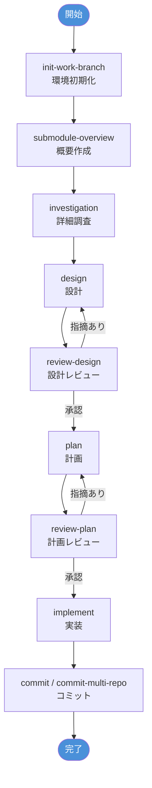
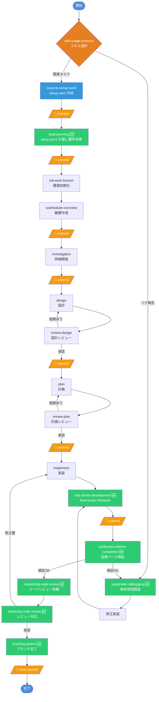

# Superpowers Integration Plan

`@submodules/superpowers` のプロセスを現在のリポジトリ（`dev-process`）に統合するための計画書。

---

## 1. 概要

### 目的

`superpowers` は Claude Code 向けのスキルプラグインで、14 のプロセススキル、1 つのエージェント、3 つのコマンド、SessionStart フックを提供する。本計画書は、既存の `dev-process` スキル（11 スキル）と比較し、統合方針を提案する。

### 方針

| 方針         | 説明                                                    |
| ------------ | ------------------------------------------------------- |
| **強化**     | 既存スキルに superpowers のベストプラクティスを取り込む |
| **新規導入** | 既存に相当するスキルがないものを新規追加する            |
| **統合不要** | 既存スキルが十分にカバーしている場合はスキップ          |

---

## 2. スキル対応マッピング

### 凡例

- 🟢 **直接対応** — 既存スキルがほぼ同等の機能を持つ
- 🟡 **部分対応** — 一部カバーされるが差分あり
- 🔴 **対応なし** — 新規導入が必要

| #   | Superpowers スキル               | 既存 dev-process スキル        | 対応度 | 推奨アクション   |
| --- | -------------------------------- | ------------------------------ | ------ | ---------------- |
| 1   | `brainstorming`                  | —                              | 🔴      | 新規導入         |
| 2   | `writing-plans`                  | `plan`                         | 🟢      | 強化のみ         |
| 3   | `executing-plans`                | `implement`                    | 🟢      | 強化のみ         |
| 4   | `subagent-driven-development`    | `implement`                    | 🟡      | 機能統合         |
| 5   | `dispatching-parallel-agents`    | `implement`                    | 🟡      | 機能統合         |
| 6   | `test-driven-development`        | —                              | 🔴      | 新規導入         |
| 7   | `systematic-debugging`           | —                              | 🔴      | 新規導入         |
| 8   | `verification-before-completion` | —                              | 🔴      | 新規導入         |
| 9   | `writing-skills`                 | —                              | 🔴      | 新規導入         |
| 10  | `using-superpowers`              | —                              | 🔴      | 新規導入（改名） |
| 11  | `using-git-worktrees`            | `init-work-branch`             | 🟢      | 統合不要         |
| 12  | `finishing-a-development-branch` | `commit`, `commit-multi-repo`  | 🟡      | 機能統合         |
| 13  | `requesting-code-review`         | `review-design`, `review-plan` | 🟡      | 機能統合         |
| 14  | `receiving-code-review`          | —                              | 🔴      | 新規導入         |

---

## 3. 詳細分析

### 3.1 新規導入（🔴）— 6 スキル

#### 3.1.1 `brainstorming` → 新規: `brainstorming`

**理由**: 既存スキルには「実装前の要件・デザイン探索」に特化したプロセスがない。`investigation` は既存コードの調査に焦点を当てており、創造的な対話による要件定義は含まれていない。

**主要機能**:
- 一度に一つの質問で要件を掘り下げる対話プロセス
- 200〜300 語のセクション単位でデザインを提示し逐次確認
- YAGNI・段階的検証の原則

**導入先**: `.claude/skills/brainstorming/SKILL.md`

**適応ポイント**:
- 日本語対応（質問・デザイン提示を日本語で行う選択肢）
- 既存の `investigation` → `design` フローの前段として位置づけ

---

#### 3.1.2 `test-driven-development` → 新規: `test-driven-development`

**理由**: 既存スキルには TDD プロセスの明示的なガイドがない。`plan` にテスト戦略の記載はあるが、Red-Green-Refactor サイクルの強制は行っていない。

**主要機能**:
- Red-Green-Refactor サイクルの厳格な適用
- テストが失敗するのを確認してからプロダクションコードを書く
- 最小限のコードでテスト通過 → リファクタリング

**導入先**: `.claude/skills/test-driven-development/SKILL.md`

**適応ポイント**:
- 既存の `implement` スキルから参照可能にする
- `plan` のプロンプトテンプレートに TDD 手順を組み込む

---

#### 3.1.3 `systematic-debugging` → 新規: `systematic-debugging`

**理由**: 既存スキルにはデバッグに特化したプロセスがない。

**主要機能**:
- 4 フェーズ: 根本原因調査 → パターン分析 → 仮説・テスト → 実装
- 「修正前に根本原因を特定」の原則
- 複数修正が失敗した場合のアーキテクチャ再検討

**導入先**: `.claude/skills/systematic-debugging/SKILL.md`

**適応ポイント**:
- 既存の `investigation` スキルとの連携を記述
- Mermaid 図による原因分析の可視化パターンを追加

---

#### 3.1.4 `verification-before-completion` → 新規: `verification-before-completion`

**理由**: 既存スキルでは完了報告前の検証が明示的にプロセス化されていない。

**主要機能**:
- 「証拠のない成功主張を禁止」の原則
- 検証コマンドの実行と出力確認のゲート関数
- 合理化（rationalization）防止パターン

**導入先**: `.claude/skills/verification-before-completion/SKILL.md`

**適応ポイント**:
- `implement` スキルの完了処理に統合
- `commit` / `commit-multi-repo` の前ステップとして参照

---

#### 3.1.5 `writing-skills` → 新規: `writing-skills`

**理由**: 既存スキルにはスキル自体の作成・メンテナンスガイドがない。

**主要機能**:
- スキル作成を TDD として扱う（サブエージェント = テスト）
- SKILL.md の構造規約（frontmatter, Claude Search Optimization）
- Red-Green-Refactor サイクルでのスキル開発

**導入先**: `.claude/skills/writing-skills/SKILL.md`

**適応ポイント**:
- 既存スキルの frontmatter 規約（`name`, `description`）との整合
- 日本語の description もサポート

---

#### 3.1.6 `receiving-code-review` → 新規: `receiving-code-review`

**理由**: 既存の `review-design` / `review-plan` はレビュー「実施」側のスキルであり、レビューフィードバックの「受け取り」プロセスがない。

**主要機能**:
- レビューフィードバックへの技術的・検証ベースの応答パターン
- 「パフォーマティブな同意」の禁止
- 不明確なフィードバックへの対応と技術的根拠による反論

**導入先**: `.claude/skills/receiving-code-review/SKILL.md`

---

### 3.2 機能統合（🟡）— 4 スキル

#### 3.2.1 `subagent-driven-development` → `implement` に統合

**差分**: superpowers 版は「同一セッション内でのサブエージェント派遣 + 2 段階レビュー（仕様準拠 + コード品質）」を持つ。既存の `implement` はサブエージェント委譲を行うが、2 段階レビューのプロセスがない。

**提案**:
- `implement` に「サブエージェント戻り値の 2 段階レビュー」セクションを追加

---

#### 3.2.2 `dispatching-parallel-agents` → `implement` に統合

**差分**: superpowers 版は「3+ テストファイルが異なる原因で失敗している場合」など、デバッグ文脈での並列エージェント派遣に特化した判断フローチャートを持つ。既存の `implement` は並列タスクの worktree 管理を持つが、「いつ並列化すべきか」の判断基準が弱い。

**提案**:
- `implement` に「並列化判断フローチャート」セクションを追加
- デバッグ文脈での用法は新規 `systematic-debugging` スキルから参照

---

#### 3.2.3 `finishing-a-development-branch` → `commit` / `commit-multi-repo` に統合

**差分**: superpowers 版は「テスト検証 → 完了オプション提示（マージ/PR/ブランチ維持/破棄） → クリーンアップ」のワークフローを持つ。既存の `commit` はコミットメッセージ生成に特化しており、ブランチ完了のライフサイクル管理がない。

**提案**:
- 新規スキル `finishing-branch` を `.claude/skills/` 配下に作成
- `commit` / `commit-multi-repo` からの参照を追加
- PR 作成、ブランチクリーンアップの手順を含める

---

#### 3.2.4 `requesting-code-review` → `review-design` / `review-plan` に統合

**差分**: superpowers 版は `code-reviewer` サブエージェントの活用と、SHA ベースの差分レビュー依頼テンプレートを持つ。既存のレビュースキルは設計・計画の観点別レビューに特化しているが、コードレビューの依頼プロセスがない。

**提案**:
- 新規スキル `requesting-code-review` を `.claude/skills/` 配下に作成
- `code-reviewer` エージェントの導入（後述の agents セクション参照）
- 既存 `review-design` / `review-plan` との連携フローを記述

---

### 3.3 既存で十分（🟢）— 3 スキル

#### 3.3.1 `writing-plans`

既存の `plan` が同等機能をカバー。

**軽微な強化案**:
- `plan` に「bite-sized task」の具体的な粒度ガイドライン（superpowers の「5 分単位」推奨）を追加

---

#### 3.3.2 `executing-plans`

既存の `implement` が同等機能をカバー。

**軽微な強化案**:
- `implement` にバッチ実行 + チェックポイントの概念を明示化
- 「いつ停止すべきか」の判断基準を追加

---

#### 3.3.3 `using-git-worktrees`

既存の `init-work-branch` + `implement` が同等機能をカバー。

**軽微な強化案**:
- `.gitignore` へのワークツリーディレクトリ追加の安全確認を `init-work-branch` に追加

---

### 3.4 メタスキル: `using-superpowers` → `skill-usage-protocol`

**理由**: これはスキル呼び出しのメタプロトコル。既存リポジトリには同等のものがない。

**提案**:
- `.claude/skills/skill-usage-protocol/SKILL.md` として導入
- 「最低限の関連可能性でもスキルを呼び出す」原則を適用
- SessionStart フックでの自動注入を検討

---

## 4. エージェント・コマンド・フックの統合

### 4.1 エージェント

| Superpowers     | 既存 | 推奨                                               |
| --------------- | ---- | -------------------------------------------------- |
| `code-reviewer` | なし | `.github/agents/code-reviewer.agent.md` として導入 |

**`code-reviewer` エージェントの役割**:
- 計画との整合性分析
- コード品質評価（エラーハンドリング、型安全性等）
- アーキテクチャ・設計レビュー
- Issue 分類（Critical / Important / Suggestion）

**適応ポイント**:
- 既存の `review-design` / `review-plan` の判定基準（✅承認 / ⚠️条件付き / ❌差し戻し）を統合
- 日本語でのレビューコメント出力オプション

---

### 4.2 コマンド

| Superpowers コマンド | 対応スキル        | 推奨                       |
| -------------------- | ----------------- | -------------------------- |
| `/brainstorm`        | `brainstorming`   | 新規導入                   |
| `/write-plan`        | `writing-plans`   | `plan` 呼び出しに変換      |
| `/execute-plan`      | `executing-plans` | `implement` 呼び出しに変換 |

---

### 4.3 フック（Claude Code / GitHub Copilot 両対応）

セッション開始時に `skill-usage-protocol` の内容を自動注入し、スキル活用を促す。Claude Code と GitHub Copilot の両方がフック機構を持つため、同一のシェルスクリプトを共有できる。

#### プラットフォーム別メカニズム

| 項目               | Claude Code          | GitHub Copilot             |
| ------------------ | -------------------- | -------------------------- |
| **設定ファイル**   | `.claude/hooks.json` | `.github/hooks/hooks.json` |
| **フックイベント** | `SessionStart`       | `sessionStart`             |
| **スクリプト指定** | `command` キー       | `bash` / `powershell` キー |
| **入力方式**       | 環境変数             | stdin (JSON)               |

#### 共有スクリプト

`scripts/hooks/session-start.sh` を両プラットフォームから呼び出す。スクリプトは `.claude/skills/skill-usage-protocol/SKILL.md` を読み込み、コンテキストとして注入する。

**Claude Code（`.claude/hooks.json`）:**

```jsonc
{
  "hooks": {
    "SessionStart": [
      {
        "matcher": "startup|resume|clear|compact",
        "hooks": [
          {
            "type": "command",
            "command": "scripts/hooks/session-start.sh",
            "async": true
          }
        ]
      }
    ]
  }
}
```

**GitHub Copilot（`.github/hooks/hooks.json`）:**

```jsonc
{
  "version": 1,
  "hooks": {
    "sessionStart": [
      {
        "type": "command",
        "bash": "./scripts/hooks/session-start.sh",
        "cwd": ".",
        "timeoutSec": 10
      }
    ]
  }
}
```

#### スクリプト実装イメージ

```bash
#!/usr/bin/env bash
# scripts/hooks/session-start.sh
# Claude Code / GitHub Copilot 共通のセッション開始フック

set -euo pipefail
SCRIPT_DIR="$(cd "$(dirname "${BASH_SOURCE[0]:-$0}")" && pwd)"
REPO_ROOT="$(cd "${SCRIPT_DIR}/../.." && pwd)"

SKILL_FILE="${REPO_ROOT}/.claude/skills/skill-usage-protocol/SKILL.md"
if [ ! -f "$SKILL_FILE" ]; then
  exit 0
fi

CONTENT=$(cat "$SKILL_FILE")

# プラットフォーム判定: stdin があれば Copilot、なければ Claude Code
if [ -t 0 ]; then
  # Claude Code: additionalContext として JSON 出力
  # （escape 処理は省略）
  echo "{\"hookSpecificOutput\":{\"additionalContext\":\"...\"}}"
else
  # GitHub Copilot: stdin から JSON を受け取り、処理後に出力
  INPUT=$(cat)
  echo "{}"
fi
```

---

## 5. 統合優先度

### Phase 1: 高優先度（品質向上に直結）
| #   | スキル                           | 理由                           |
| --- | -------------------------------- | ------------------------------ |
| 1   | `verification-before-completion` | 全スキルの品質ゲートとして機能 |
| 2   | `test-driven-development`        | 実装品質の根本的改善           |
| 3   | `systematic-debugging`           | デバッグ効率の大幅向上         |
| 4   | `skill-usage-protocol`           | スキル活用率の向上             |

### Phase 2: 中優先度（ワークフロー強化）

| #   | スキル                                           | 理由                           |
| --- | ------------------------------------------------ | ------------------------------ |
| 5   | `brainstorming`                                  | 要件定義の品質向上             |
| 6   | `finishing-branch`                               | ブランチライフサイクルの完全化 |
| 7   | `requesting-code-review` + `code-reviewer` agent | コードレビュープロセスの体系化 |
| 8   | `receiving-code-review`                          | レビュー対応の品質向上         |

### Phase 3: 低優先度（メンテナンス強化）

| #   | スキル                   | 理由                       |
| --- | ------------------------ | -------------------------- |
| 9   | `writing-skills`         | スキルのメンテナンス性向上 |
| 10  | 既存スキルへの軽微な強化 | 段階的改善                 |

---

## 6. 既存スキルへの推奨変更サマリー

| 既存スキル                      | 変更内容                                                                                                                                       |
| ------------------------------- | ---------------------------------------------------------------------------------------------------------------------------------------------- |
| `implement`                     | サブエージェント 2 段階レビュー追加、並列化判断フローチャート追加、バッチ実行チェックポイント明示化、`verification-before-completion` 参照追加 |
| `plan`                          | bite-sized task の粒度ガイドライン追加                                                                                                         |
| `init-work-branch`              | `.gitignore` への worktree ディレクトリ安全確認追加                                                                                            |
| `commit`                        | `finishing-branch` スキルへの参照追加                                                                                                          |
| `review-design` / `review-plan` | `requesting-code-review` / `code-reviewer` への参照追加                                                                                        |

---

## 7. ディレクトリ構成（統合後）

```
.claude/skills/
├── brainstorming/                      # 🆕
├── commit/
├── commit-multi-repo/
├── design/                             # 強化
├── finishing-branch/                    # 🆕
├── implement/                          # 強化
├── init-work-branch/                   # 強化
├── investigation/
├── issue-to-setup-yaml/
├── plan/                               # 強化
├── receiving-code-review/              # 🆕
├── requesting-code-review/             # 🆕
├── review-design/                      # 強化
├── review-plan/                        # 強化
├── skill-usage-protocol/               # 🆕
├── submodule-overview/
├── systematic-debugging/               # 🆕
├── test-driven-development/            # 🆕
├── verification-before-completion/     # 🆕
└── writing-skills/                     # 🆕

.github/agents/
├── call-dev-planning-manager.agent.md
├── call-general-purpose.agent.md
├── code-reviewer.agent.md              # 🆕
├── dev-planning-manager.agent.md
└── general-purpose.agent.md
```

---

## 8. 開発プロセスの変化（Before / After）

### 8.1 Before（現行プロセス）



### 8.2 After（Superpowers 統合後プロセス）



### 8.3 `project.yaml` — プロジェクトコンテキストファイル

`setup.yaml` を初期入力とし、`brainstorming` 完了時に **`project.yaml`** を生成する。以降の全プロセスはこのファイルを入力として読み込み、完了時に自セクションを追記してコミットする。

#### 設計方針

| 方針                    | 説明                                                                   |
| ----------------------- | ---------------------------------------------------------------------- |
| **YAML はインデックス** | 各プロセスの状態・要約・成果物パスを記録。詳細は外部ドキュメントに委譲 |
| **肥大化防止**          | 各セクションの `summary` は 3 行以内。詳細は `artifacts` パスで参照    |
| **累積更新**            | 各プロセスは自セクションのみ追記/更新。他セクションは読み取り専用      |
| **setup.yaml 互換**     | `meta` + `setup` セクションに setup.yaml の内容をそのまま保持          |

#### フォーマット定義

```yaml
# =============================================================================
# project.yaml — プロジェクトコンテキストファイル（全プロセスの SSOT）
# =============================================================================
# brainstorming プロセスが setup.yaml を基に初期生成。
# 以降の各プロセスが自セクションを追記し、コミットする。

# -----------------------------------------------------------------------------
# メタ情報
# -----------------------------------------------------------------------------
meta:
  version: "1.0"
  ticket_id: "PROJ-123"
  task_name: "ユーザー認証機能の追加"
  target_repo: "main-application"
  branch: "feature/PROJ-123"
  created_at: "2025-02-11T10:00:00+09:00"
  updated_at: "2025-02-11T15:30:00+09:00"  # 各プロセスが更新

# -----------------------------------------------------------------------------
# setup（setup.yaml から引き継ぎ — 読み取り専用）
# -----------------------------------------------------------------------------
setup:
  description:
    overview: "..."
    purpose: "..."
    background: "..."
    requirements:
      functional: ["..."]
      non_functional: ["..."]
    acceptance_criteria: ["..."]
    scope: ["..."]
    out_of_scope: ["..."]
    notes: "..."
  related_repositories: [{ name: "...", url: "..." }]
  target_repositories: [{ name: "...", url: "..." }]
  options:
    create_design_document: true
    design_document_dir: "docs"
    submodules_dir: "submodules"

# -----------------------------------------------------------------------------
# brainstorming（brainstorming プロセスが記入）
# -----------------------------------------------------------------------------
brainstorming:
  status: completed          # pending | in_progress | completed
  completed_at: "2025-02-11T10:30:00+09:00"
  summary: |
    対話を通じて要件を深掘りし、3つの設計方針を検討。
    方針Bを採用。認証方式はJWTベースに決定。
  decisions:                 # 主要な決定事項（5件以内）
    - question: "認証方式は？"
      decision: "JWTベース"
    - question: "セッション管理は？"
      decision: "Redis で管理"
  refined_requirements:      # brainstorming で追加・修正された要件
    - "リフレッシュトークンによる自動更新"
    - "OAuth2.0 プロバイダ連携"
  artifacts: "docs/{repo}/brainstorming/"

# -----------------------------------------------------------------------------
# overview（submodule-overview プロセスが記入）
# -----------------------------------------------------------------------------
overview:
  status: completed
  completed_at: "2025-02-11T11:00:00+09:00"
  summary: "対象リポジトリの構造・技術スタックを把握"
  artifacts: "docs/{repo}/overview.md"

# -----------------------------------------------------------------------------
# investigation（investigation プロセスが記入）
# -----------------------------------------------------------------------------
investigation:
  status: completed
  completed_at: "2025-02-11T12:00:00+09:00"
  summary: |
    既存認証基盤のアーキテクチャを調査。
    ミドルウェア層での拡張が最適と判断。
  key_findings:              # 重要な発見（5件以内）
    - "認証ミドルウェアは middleware/auth.go に集約"
    - "既存テストカバレッジ: 78%"
  risks:                     # 特定されたリスク（3件以内）
    - "セッションストア移行時のダウンタイム"
  artifacts: "docs/{repo}/investigation/"

# -----------------------------------------------------------------------------
# design（design + review-design プロセスが記入）
# -----------------------------------------------------------------------------
design:
  status: completed
  completed_at: "2025-02-11T13:00:00+09:00"
  summary: "JWT + Redis 構成の認証基盤を設計。レビュー承認済み"
  approach: "ミドルウェア層にJWT検証を追加、Redisでセッション管理"
  key_decisions:             # 設計上の主要決定（5件以内）
    - "トークン有効期限: アクセス15分、リフレッシュ7日"
    - "Redis はクラスタモードで運用"
  review:
    status: approved         # approved | revision_required
    round: 1
    notes: "セキュリティ要件を満たしている"
  artifacts: "docs/{repo}/design/"

# -----------------------------------------------------------------------------
# plan（plan + review-plan プロセスが記入）
# -----------------------------------------------------------------------------
plan:
  status: completed
  completed_at: "2025-02-11T14:00:00+09:00"
  summary: "5タスクに分割。依存関係を整理し、並列実行可能なグループを特定"
  total_tasks: 5
  tasks:                     # タスク一覧（ID + タイトル + ステータスのみ）
    - { id: "task01", title: "JWT ライブラリ導入", status: pending }
    - { id: "task02", title: "認証ミドルウェア実装", status: pending }
    - { id: "task03", title: "Redis セッションストア", status: pending }
    - { id: "task04", title: "リフレッシュトークン API", status: pending }
    - { id: "task05", title: "統合テスト", status: pending }
  review:
    status: approved
    round: 1
  artifacts: "docs/{repo}/plan/"

# -----------------------------------------------------------------------------
# implement（implement + TDD プロセスが記入）
# -----------------------------------------------------------------------------
implement:
  status: in_progress
  started_at: "2025-02-11T14:30:00+09:00"
  completed_tasks: 3
  total_tasks: 5
  tasks:                     # plan.tasks のステータスを更新
    - { id: "task01", status: completed, commit: "a1b2c3d" }
    - { id: "task02", status: completed, commit: "e4f5g6h" }
    - { id: "task03", status: completed, commit: "i7j8k9l" }
    - { id: "task04", status: in_progress }
    - { id: "task05", status: pending }
  artifacts: "docs/{repo}/implement/"

# -----------------------------------------------------------------------------
# verification（verification-before-completion プロセスが記入）
# -----------------------------------------------------------------------------
verification:
  status: completed
  completed_at: "2025-02-11T15:00:00+09:00"
  test_results:
    passed: 42
    failed: 0
    coverage: "85%"
  evidence: ["全テストパス", "lint エラーなし", "ビルド成功"]

# -----------------------------------------------------------------------------
# code_review（requesting/receiving-code-review プロセスが記入）
# -----------------------------------------------------------------------------
code_review:
  status: approved
  rounds:
    - { round: 1, result: revision_required, issues: 2 }
    - { round: 2, result: approved, issues: 0 }

# -----------------------------------------------------------------------------
# finishing（finishing-branch プロセスが記入）
# -----------------------------------------------------------------------------
finishing:
  status: completed
  completed_at: "2025-02-11T15:30:00+09:00"
  action: merge              # merge | pr | keep | discard
  pr_url: "https://github.com/org/repo/pull/42"
```

### 8.4 プロセス別 更新内容・成果物・コミット

各プロセス完了時に **project.yaml の自セクションを更新** + **成果物をファイル出力** し、即座にコミットする。

| #   | プロセス              | project.yaml 更新                             | 成果物出力先                                  | コミット内容                      |
| --- | --------------------- | --------------------------------------------- | --------------------------------------------- | --------------------------------- |
| 1   | `issue-to-setup-yaml` | — (setup.yaml を作成)                         | `setup.yaml`                                  | `docs: setup.yaml を作成`         |
| 2   | `brainstorming`       | `meta` + `setup` + `brainstorming` を初期生成 | `project.yaml` + `docs/{repo}/brainstorming/` | `docs: project.yaml を生成`       |
| 3   | `submodule-overview`  | `overview` セクション追記                     | `docs/{repo}/overview.md`                     | `docs: overview を追加`           |
| 4   | `investigation`       | `investigation` セクション追記                | `docs/{repo}/investigation/` (6ファイル)      | `docs: investigation を追加`      |
| 5   | `design`              | `design` セクション追記                       | `docs/{repo}/design/` (6ファイル)             | `docs: design を追加`             |
| 5a  | `review-design`       | `design.review` を更新                        | `docs/{repo}/design/` に追記                  | `docs: design レビュー結果を反映` |
| 6   | `plan`                | `plan` セクション追記                         | `docs/{repo}/plan/` (タスクファイル群)        | `docs: plan を追加`               |
| 6a  | `review-plan`         | `plan.review` を更新                          | `docs/{repo}/plan/` に追記                    | `docs: plan レビュー結果を反映`   |
| 7   | `implement` + TDD     | `implement` セクション追記・更新              | ソースコード + `docs/{repo}/implement/`       | `feat: タスク{N} を実装`          |
| 8   | verification          | `verification` セクション追記                 | —                                             | `docs: verification 結果を記録`   |
| 9   | code review           | `code_review` セクション追記                  | —                                             | `docs: code review 結果を記録`    |
| 10  | `finishing-branch`    | `finishing` セクション追記                    | —                                             | `chore: ブランチ完了処理`         |

### 8.5 主な変更ポイント

| #   | 変更ポイント                        | 説明                                                                                                              |
| --- | ----------------------------------- | ----------------------------------------------------------------------------------------------------------------- |
| 1   | **setup.yaml → project.yaml**       | brainstorming が setup.yaml を基に project.yaml を生成。以降の全プロセスの SSOT として機能                        |
| 2   | **インデックス + 外部ドキュメント** | project.yaml には要約・ステータス・パスのみ記録。詳細は `artifacts` パスの外部ドキュメントに委譲し、肥大化を防止  |
| 3   | **プロセス毎コミット**              | 各プロセス完了時に project.yaml + 成果物を💾コミット。Git 履歴で進捗を追跡可能に                                   |
| 4   | **要件定義の強化**                  | `brainstorming` が setup.yaml を入力として対話的に要件を深掘り、`refined_requirements` として project.yaml に記録 |
| 5   | **TDD の組み込み**                  | `implement` → `test-driven-development` で Red-Green-Refactor を必須化                                            |
| 6   | **完了前検証の義務化**              | `verification-before-completion` の結果を project.yaml に記録し、証拠なき成功主張を防止                           |
| 7   | **コードレビューサイクル**          | `requesting-code-review` → `receiving-code-review` の結果をラウンド別に記録                                       |
| 8   | **デバッグの体系化**                | `systematic-debugging` で4フェーズの根本原因解析プロセスを導入                                                    |
| 9   | **ブランチ完了管理**                | `finishing-branch` の最終アクション（merge/PR/破棄）を記録                                                        |

---

## 9. 注意事項

> [!IMPORTANT]
> - 既存スキルの日本語コミットメッセージ規約を維持すること
> - `setup.yaml` を SSOT とする既存のワークフロー体系を壊さないこと
> - 新規スキルの frontmatter (`name`, `description`) は既存規約に従うこと

> [!WARNING]
> - `skill-usage-protocol` のフック設定は Claude Code（`.claude/hooks.json`）と GitHub Copilot（`.github/hooks/hooks.json`）の 2 箇所に配置が必要。共有スクリプト `scripts/hooks/session-start.sh` の入出力形式がプラットフォームごとに異なる点に注意すること。
> - superpowers の worktree 管理は `/tmp/` 配下を使用するが、既存の `init-work-branch` / `implement` も同様のパターン。競合しないよう命名規則を統一すること。
